# **用户指南**

## **Demo说明**
>本Demo基于简单的案例引导大家举一反三学会使用JarsLink用于日常工作，本教程目前提供如下情景Demo演示：
- (情景一)工作流业务特性逻辑动态处理:模拟消费金融相似的风控审核流程，基于不同的产品，路由到对应产品的模块Jar去执行特性逻辑
- (情景二)在线动态切换缓存:模拟在线不停机切换底层缓存框架
- (情景三)插拔式增删功能:模拟日常工作中一些功能可以在线不停机插拔式添加和下架(未完成)
## **模块说明**

> module-main 核心模块，用于加载模块JAR包，对外提供服务

> workflow-module-taobao 【工作流业务特性逻辑动态处理演示模块】用于模拟处理taobao产品业务逻辑的Jar包

> workflow-module-tencent 【工作流业务特性逻辑动态处理演示模块】用于模拟处理tencent产品业务逻辑的Jar包

> cache-module-api 【缓存情景演示模块】用于存放缓存模块的公用组件的Jar包

> cache-module-memory 【缓存情景演示模块】用于模拟执行内存操作的Jar包

> cache-module-mongodb 【缓存情景演示模块】用于模拟执行MongoDb操作的Jar包

> cache-module-redis 【缓存情景演示模块】用于模拟执行redis操作的Jar包
***

## **使用说明**

启动com.eshare.ModuleApplication后

default:http://localhost:8080/

首页会看到如下界面：

>**准备工作:**

>使用前创建目录:D:\upload\lib和D:\upload\process

### **情景一环境部署**

**情景说明:**

本demo通过 "workflow-module-taobao" 和 "workflow-module-tencent" 分别去模拟处理两个产品不同业务特性请求

**使用步骤:**

- 将项目process目录下的流程common_risk_approval_process.uflo.xml放在D:\upload\process目录下

- 使用Mave命令 "mvn package" 分别对workflow-module-taobao和workflow-module-tencent两个模块打包，
生成workflow-module-taobao-0.0.1.jar和workflow-module-tencent-0.0.1.jar文件

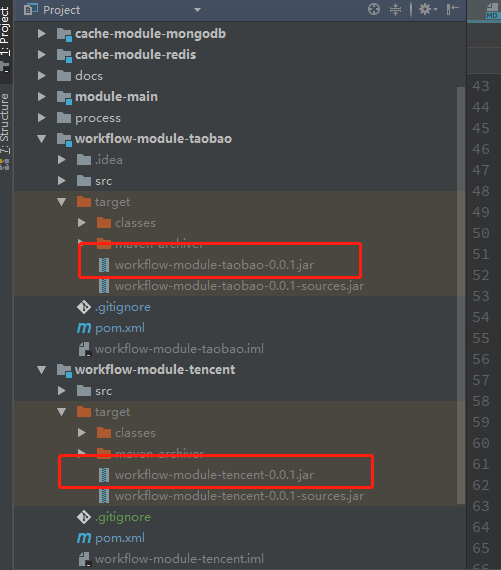

- 运行 "ModuleApplication"

- 输入http://localhost:8080/会看到如下界面

- 选择场景一，进入演示场景，会显示如下界面:

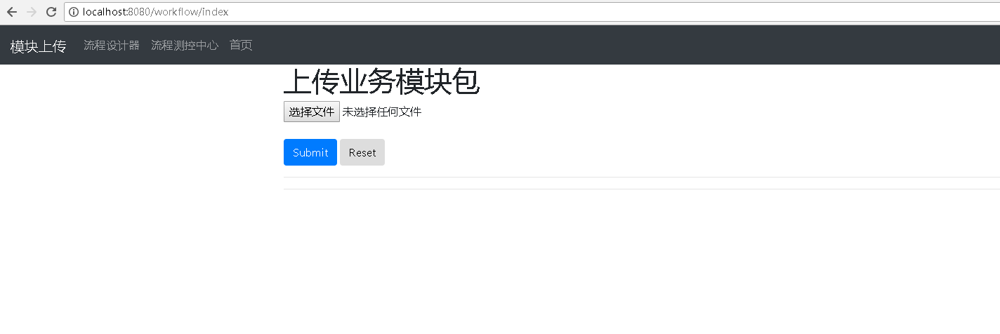

- 分别上传之前打包好的模块包workflow-module-taobao-0.0.1.jar和workflow-module-tencent-0.0.1.jar，上传成功后在界面会
看到成功提示，并且在D:\upload\lib目录下会看到我们上传的Jar包

- 点击流程控制中心，上传我们放在项目process下的流程模板,会看到如下界面：
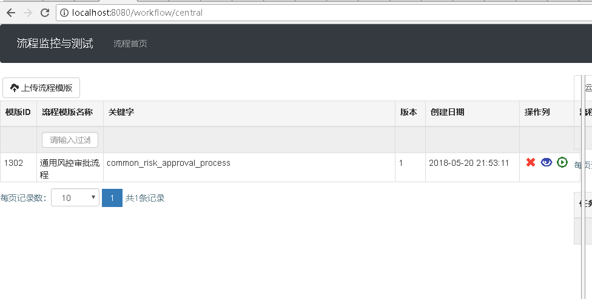

- 点击运行按钮 ,如下图所示输入
流程变量参数，然后点击开启流程
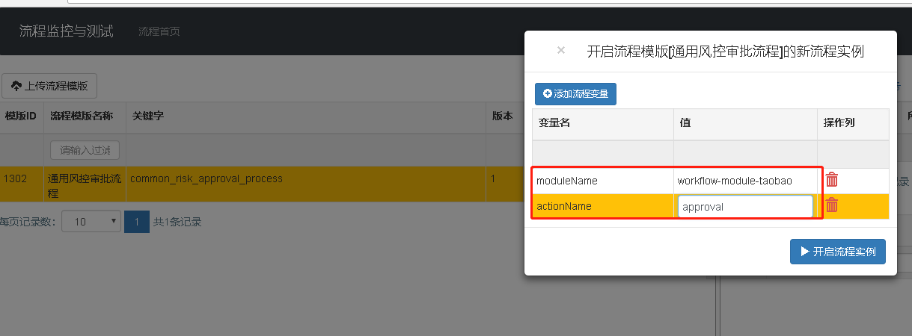
>这里是用于模拟一个流程模板为多个不同产品服务的场景，这里的输入参数用来告诉程序使用
taobao模块的approval动作去处理

- 执行流程后，可以在控制台看到日志，如下图所示:

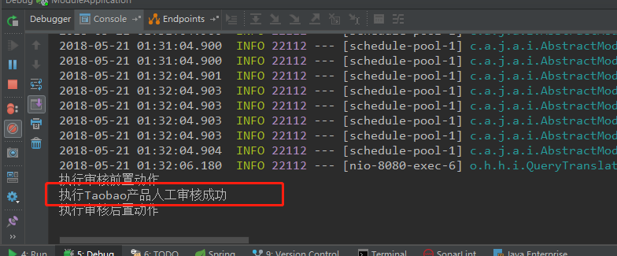

>意味着程序已经成功把请求交到taobao模块去执行了

***

#### **工作原理**

>工作原理是当流程接收到A产品的请求，自动路由到A模块去处理具体的审核逻辑;当流程接收到B产品的请求，自动路由到B模块去处理具体的审核逻辑;
从而实现同一个流程模板可以多个产品使用，各个产品实现对应产品的业务特性逻辑。

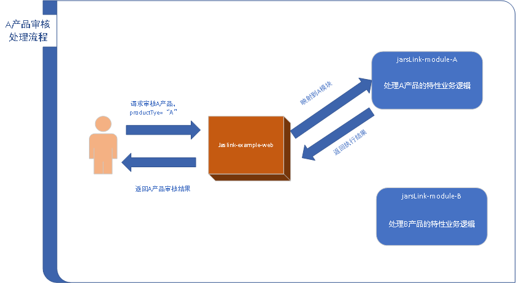

***

### **情景二环境部署**

**情景说明:**

本demo通过cache-module-memory、cache-module-mongodb、cache-module-redis 几个模块模拟在线切无感知切换底层缓存框架

**使用步骤:**

- 使用Mave命令 "mvn package" 分别对cache-module-memory、cache-module-mongodb和cache-module-redis三个模块打包，
  生成cache-module-memory-0.0.1.jar、cache-module-mongodb-0.0.1.jar和cache-module-redis-0.0.1.jar三个JAR包
  
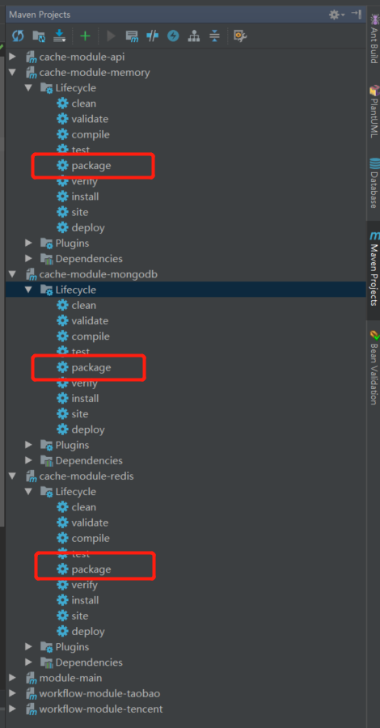

- 运行 "ModuleApplication"

- 输入http://localhost:8080/会看到如下界面

- 选择场景二，进入演示场景，会显示如下界面:

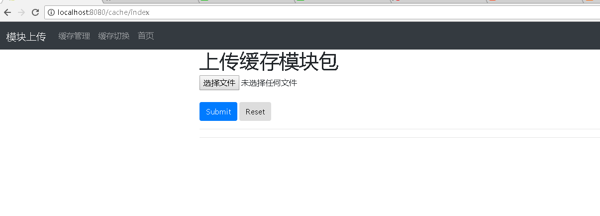

- 分别上传之前打包好的模块包cache-module-memory-0.0.1.jar、cache-module-mongodb-0.0.1.jar和cache-module-redis-0.0.1.jar，上传成功后在界面会
看到成功提示，并且在D:\upload\lib目录下会看到我们上传的Jar包

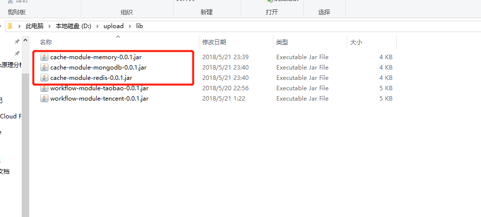

- 点击缓存管理，会看到如下图界面，这时候我们可以设置我们的缓存key和value，并且可以通过key进行查询操作:

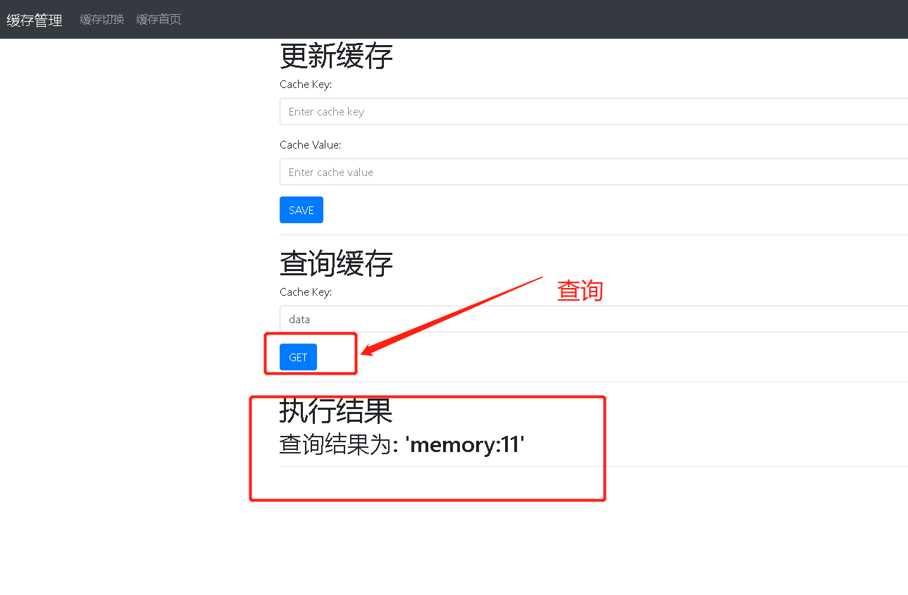

- 点击缓存切换，输入模块名称和版本号，可以在线无感知切换底层缓存框架，这里模拟缓存从memory切换成redis存储:

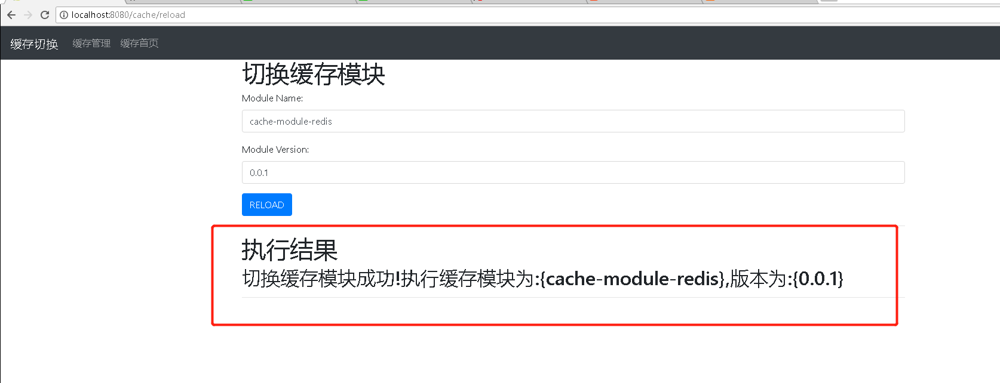
